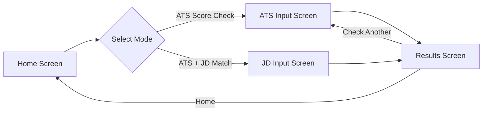
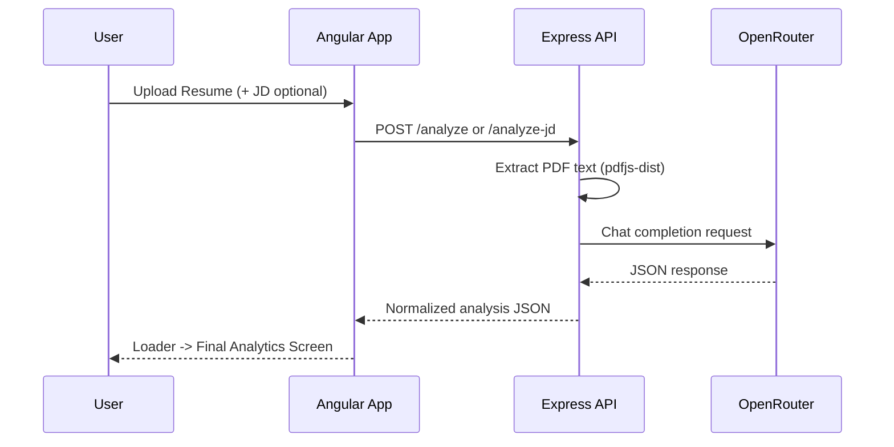

# Angular AI Analyzer

A modern, neumorphism-inspired resume analysis platform with two workflows:

1. `ATS Score Check`
2. `ATS + Job Description Match`

Built with Angular 21 (frontend) and Node.js/Express (backend), powered by OpenRouter for AI analysis.

---

## Product Overview

This project helps candidates evaluate resumes in two modes:

- **ATS Score Check**: resume-only quality analysis
- **ATS + JD Match**: resume versus job description with missing keywords and actionable improvement pointers

The app uses a **multi-screen flow** for clean UX:
- separate home selection page
- separate input pages
- separate results page with skeleton/progressive loading

---

## Visual Flow





---

## Feature Set

### 1) ATS Score Check
- Upload resume (`PDF/DOC/DOCX`)
- Returns:
  - `score`
  - `strengths[]`
  - `weaknesses[]`
  - `keywordsMatched`
  - `missingKeywords`
  - `contentQuality`

### 2) ATS + JD Match
- Upload resume + paste job description
- Returns:
  - `jobMatchScore`
  - `strengths[]`
  - `weaknesses[]`
  - `missingKeywords[]`
  - `improvementPointers[]`

### 3) UX & State Handling
- route-based architecture (no giant conditional rendering component)
- top navbar with:
  - `Home`
  - `Check Another`
- progressive skeleton loader on results screen
- explicit error states with retry path

---

## Tech Stack

### Frontend
- Angular 21 (standalone components)
- Rx-free local state via Angular `signal()`
- Tailwind available + custom CSS
- Neumorphism-inspired design system

### Backend
- Node.js + Express
- `pdfjs-dist` for resume text extraction
- `axios` for OpenRouter calls
- response normalization + retry-on-truncation logic

---

## Project Structure

```text
Angular-AI-Analyser/
├─ ai-resume-analyzer/                 # Angular frontend
│  ├─ src/app/pages/
│  │  ├─ home/                         # Mode selection screen
│  │  ├─ ats-check/                    # Resume-only input screen
│  │  ├─ jd-check/                     # Resume+JD input screen
│  │  └─ results/                      # Loader + analysis results screen
│  ├─ src/app/services/
│  │  └─ analysis-state.service.ts     # Shared analysis flow state
│  └─ src/app/layout/navbar/           # Global top navigation
└─ backend/
   └─ src/server.js                    # API endpoints + OpenRouter integration
```

---

## API Contract

### `POST /analyze`
Request:
```json
{ "file": "<base64-pdf>" }
```

Response:
```json
{
  "score": 88,
  "strengths": ["..."],
  "weaknesses": ["..."],
  "keywordsMatched": 24,
  "missingKeywords": 4,
  "contentQuality": 93
}
```

### `POST /analyze-jd`
Request:
```json
{
  "file": "<base64-pdf>",
  "jobDescription": "..."
}
```

Response:
```json
{
  "jobMatchScore": 81,
  "strengths": ["..."],
  "weaknesses": ["..."],
  "missingKeywords": ["Redis", "CI/CD"],
  "improvementPointers": ["Add X", "Quantify Y"]
}
```

---

## Local Setup

### 1) Backend
```bash
cd backend
npm install
```

Create `backend/.env`:
```env
OPENROUTER_API_KEY=your_key_here
OPENROUTER_MODEL=poolside/laguna-xs.2:free
APP_ORIGIN=http://localhost:4200
APP_TITLE=AI Resume Analyzer
PORT=3200
```

Run:
```bash
npm run dev
```

### 2) Frontend
```bash
cd ai-resume-analyzer
npm install
npm start
```

Open: `http://localhost:4200`

---

## Error Handling Scenarios

- Missing resume input -> user-facing validation message
- Missing JD input (JD flow) -> user-facing validation message
- OpenRouter key missing -> backend returns explicit error
- Truncated AI output -> backend retries with stricter prompt
- Invalid AI JSON -> backend returns structured failure payload
- Network/API failure -> results screen shows failure + retry affordance

---

## Roadmap Ideas

- export analysis as PDF report
- keyword trend scoring by role templates
- authentication and saved analysis history
- model fallback strategy by provider reliability

---

## License

MIT
